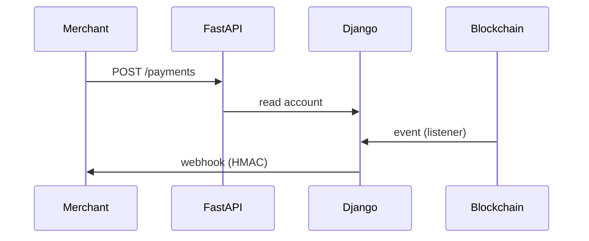
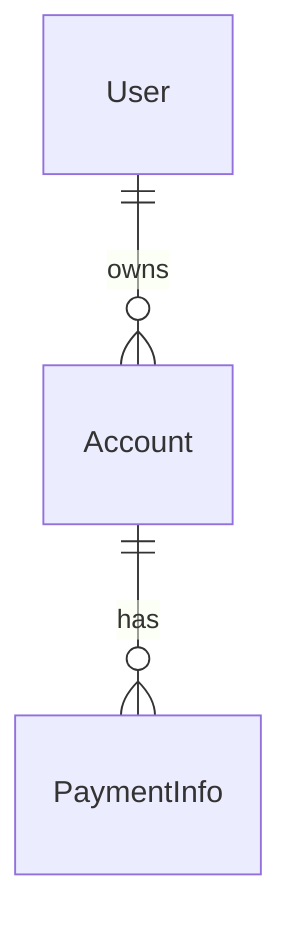

# ARCHITECTURE.md — как система устроена сейчас

ARCHITECTURE.md описывает **текущее устройство** системы: компоненты, границы,
потоки данных, инварианты. Это не «почему» (ADR) и не «как запустить» (README).

## Когда писать

- **Монорепозиторий / несколько сервисов** — сквозные границы не видны в README.
- Несколько процессов (web, worker, listener, bot) и их взаимодействие.
- Нетривиальное владение данными (кто пишет, кто читает).
- Для одиночного маленького сервиса достаточно README + диаграмм.

## Что включать

1. **Контекст и scope** — что в системе, что вне; внешние потребители.
2. **Компоненты и границы** — сервисы/процессы и их зона ответственности.
3. **Владение данными** — источник истины (схема/миграции), read-only потребители, события.
4. **Ключевые потоки** — sequence-диаграммы (mermaid).
5. **Модель данных** — ERD ключевых сущностей (mermaid).
6. **Инварианты и политики** — формат ошибок, тест-политика, слои.
7. **Ссылки на ADR** — «почему» принято.

## Что НЕ включать

- Построчный обзор кода/файлов (устареет).
- Быстро меняющиеся детали (список env — в README).
- «Почему» — это ADR; дубли README (quick start).

## Шаблон

````markdown
# Architecture — <проект>

## Контекст и scope

Что это, какие сервисы входят, кто потребители. Что вне scope.

## Компоненты

| Компонент          | Роль                                           | Технологии          |
| ------------------ | ---------------------------------------------- | ------------------- |
| `django`           | лендинг, кабинет, слушатель блокчейна, webhook | Django, Postgres    |
| `fastapi`          | JSON API создания платежей (read-only к БД)    | FastAPI, SQLAlchemy |
| `payment_listener` | подтверждение платежей, метрики, webhook       | Django Tasks        |
| `metrics_exporter` | batch-экспорт Prometheus                       | Django              |

## Владение данными

- Схема и миграции — Django (источник истины).
- FastAPI — read-only потребитель (ORM поверх таблиц, без миграций).
- События между сервисами — NATS (FastStream), идемпотентно.

## Потоки



## Модель данных



## Инварианты

- Формат ошибок — RFC 7807 (`application/problem+json`).
- Тесты — BDD (основное покрытие), unit — пробелы.
- Бизнес-логика — в сервисах; репозиторий не коммитит.

## Решения (ADR)

- [0001. Postgres вместо SQLite](adr/0001-use-postgres.md)
- [0002. Доступ к данным во FastAPI](adr/0002-fastapi-data-access.md)
````

## Диаграммы

- `sequenceDiagram` — потоки; `erDiagram` — модель данных; `flowchart` — компоненты.
- Длинные диаграммы — в `<details>`, чтобы файл оставался читаемым.
- Держать актуальными: устаревшая диаграмма хуже отсутствующей.

## Отношение к другим докам

- **README** ссылается сюда кратко, не пересказывает.
- **ADR** — «почему»; **ARCHITECTURE** — «как сейчас». При расхождении ADR — история.
- Схема слоёв и границы — здесь; правила кода — в README/AGENTS.md.

## Аудит ARCHITECTURE.md

- **CRITICAL:** противоречит коду (компонент/поток/владелец данных, которых нет).
- **HIGH:** монорепозиторий/мультисервис без ARCHITECTURE.md.
- **MEDIUM:** нет владения данными или инвариантов; устаревшие диаграммы.
- **LOW:** стиль, оформление, мелкие неточности.

## Чек-лист

- [ ] Есть контекст/scope и список компонентов.
- [ ] Указано владение данными (кто пишет/читает/мигрирует).
- [ ] Ключевые потоки — sequence-диаграммы.
- [ ] Модель данных — ERD (если нетривиальна).
- [ ] Инварианты и политики зафиксированы.
- [ ] Ссылки на ADR; нет дублей README и обзора кода.
- [ ] Диаграммы соответствуют текущему коду.
