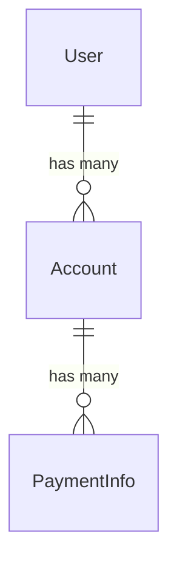

# README

README — первое, что увидит новый человек, будущий ты через полгода и агент.
Цель: за минуту понять, что это, как запустить и как деплоится. Без маркетинга.

Канонический пример конвенций — README сервиса `aneepay-main` (Django в
монорепозитории).

## Порядок секций

1. **Заголовок + бейджи** — компактный ряд стека.
2. **Назначение** — 1–2 строки: что это и какую задачу решает; кросс-ссылки на
   соседние сервисы монорепозитория.
3. **Возможности** — ключевые фичи списком.
4. **Технологии** — стек сгруппированно.
5. **Структура проекта** — аннотированное дерево.
6. **Локальная установка** — предпочтительный способ (Docker), таблица сервисов/URL.
7. **Контроль качества** — команды линта/формата/тестов (`<details>`).
8. **Маршруты** — таблицы по приложениям (метод/путь/описание).
9. **Management-команды** — назначение, env, коды выхода, пример cron.
10. **Переменные окружения** — полная таблица.
11. **Диаграммы** — mermaid (sequence/ERD) в `<details>`.
12. **Дополнительные ссылки** — внешняя документация, соседние сервисы.
13. **Деплой-заметка** — минимально: как перезапустить и где логи.

## Заголовок и бейджи

```markdown
# aneepay-main

[](https://docs.djangoproject.com/en/6.0/)
[](https://www.postgresql.org/docs/current/)
[](https://www.python.org/)
```

Компактный ряд бейджей = быстрый индикатор стека. Без «бейджей ради бейджей».

## Назначение и монорепозиторий

- 1–2 строки сути + уточнение роли сервиса.
- Ссылки на соседние сервисы: `[fastapi/](../fastapi/README.md)`.

```markdown
Основное веб-приложение для aneepay.com — non-custodial платёжный шлюз.

Django отвечает за лендинг и кабинет мерчанта, checkout-страницы, слушателя
событий блокчейна и webhook. JSON API — отдельным сервисом [fastapi/](../fastapi/README.md).
```

## Возможности и технологии

```markdown
## Возможности

- Passwordless-вход по email magic-link (10 минут).
- Личный кабинет мерчанта: CRUD платёжных аккаунтов.
- Webhook с подписью `X-Aneepay-Signature` (HMAC-SHA256) и ретраями.

## Технологии

- Django 6, PostgreSQL, psycopg 3, gunicorn, django-environ
- uv (менеджер пакетов), Ruff, django-stubs
```

## Структура проекта

Аннотированное дерево: приложения и их зона ответственности.

```markdown
```
django/
├── core/        # Конфигурация: settings, exceptions, middleware, urls
├── landing/     # Лендинг и passwordless-авторизация
├── dashboard/   # Кабинет мерчанта (CRUD аккаунтов)
├── payment/     # Checkout, слушатель блокчейна, webhook, метрики
└── manage.py
```
```

## Локальная установка

Предпочтительный способ (Docker из корня монорепозитория) + таблица сервисов/URL.

```markdown
```bash
docker compose up --watch
```

| Сервис | URL |
| --- | --- |
| Django web-app | http://localhost:8000 |
| Django Admin | http://localhost:8000/admin |
| FastAPI API | http://localhost:8080 |
| PostgreSQL | localhost:5432 |
```
```

## Прогрессивное раскрытие (`<details>`)

Длинные/опциональные блоки прятать в `<details>`, чтобы README оставался
сканируемым: команды, диаграммы, большие таблицы.

```markdown
<details>
<summary><b>Контроль качества</b></summary>

```bash
ruff check
ruff format --check
python manage.py test
```
</details>
```

## Маршруты

Таблицы по приложениям: метод, путь, описание. Группировать по домену.

```markdown
### Dashboard (требует авторизации)

| Метод | Путь | Описание |
| --- | --- | --- |
| `GET` | `/accounts/` | Список аккаунтов |
| `GET`/`POST` | `/accounts/create/` | Создание аккаунта |
| `POST` | `/accounts/<uuid:pk>/delete/` | Удаление |
```

## Management-команды

Назначение, поведение (например, «один проход — вешать на cron»), env, коды выхода,
пример cron.

```markdown
### Коды выхода (для cron-алертов)

- `0` — успех или «нечего делать»;
- `1` — не сконфигурировано или сетевая ошибка.

```cron
*/5 * * * * cd /opt/project && .venv/bin/python manage.py treasury_keeper >> /var/log/keeper.log 2>&1
```
```

## Переменные окружения

| Переменная | Описание | По умолчанию |
| --- | --- | --- |
| `TREASURY_CONVERTER_CONTRACT` | Адрес контракта | `""` (обязательная) |
| `TREASURY_KEEPER_RPC_URL` | RPC Polygon | `https://...` |

- Список должен совпадать с `.env.example` и кодом (устаревшая env = CRITICAL).
- Для больших наборов — группировать по модулю/приложению.

## Диаграммы

mermaid (sequence/ERD) — в `<details>`, чтобы не перегружать полотно.

```markdown
<details>
<summary><b>ERD моделей</b></summary>


</details>
```

## Деплой-заметка vs runbook

README хранит **минимальную** заметку — «как перезапустить и где логи». Сложный
деплой (несколько сервисов, порядок миграций, откат) — в `docs/DEPLOY.md`, README
ссылается.

## Адаптация под тип проекта

- **Django:** `migrate` + `createsuperuser` + `runserver`; прод — gunicorn/uvicorn
  под systemd, `collectstatic`, settings через env, `DJANGO_SETTINGS_MODULE`.
- **FastAPI:** dev — `--reload`; прод — gunicorn с uvicorn-воркерами за nginx.
- **aiogram-бот:** `python -m bot`; отдельный systemd-юнит; RedisStorage; один
  polling-инстанс.
- **automation-скрипт:** что делает, расписание (cron/systemd-timer), входы/выходы.

## Антипаттерны

| ❌ | ✅ |
|---|---|
| README противоречит коду | сверить и починить |
| «В современном мире…» | назначение в 1–2 строках |
| Дублировать конфиги | ссылаться |
| README как runbook | деплой-заметка + ссылка |
| Всё полотно без `<details>` | прятать длинные блоки |
| Бейджи ради бейджей | компактный ряд стека |
| «TODO: написать документацию» | честные строки сейчас |
| Описание внутренней реализации | в ARCHITECTURE/docstrings |

## Чек-лист

- [ ] Заголовок + компактные бейджи; назначение 1–2 строки.
- [ ] Кросс-ссылки на соседние сервисы (монорепозиторий).
- [ ] Возможности, технологии, структура проекта.
- [ ] Локальная установка + таблица сервисов/URL.
- [ ] Команды качества, маршруты, management-команды, env.
- [ ] Диаграммы и длинные блоки — в `<details>`.
- [ ] Деплой-заметка; ссылки на архитектуру/ADR.
- [ ] Команды/env совпадают с кодом и `.env.example`.
